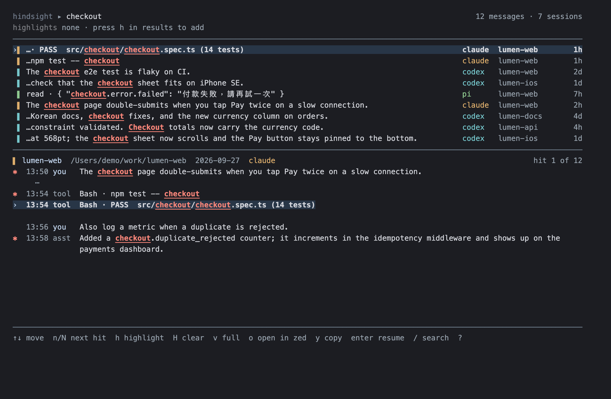
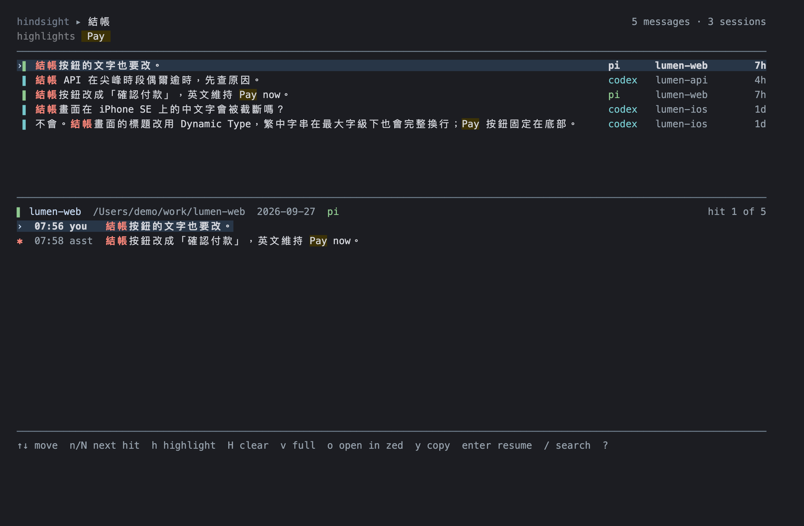
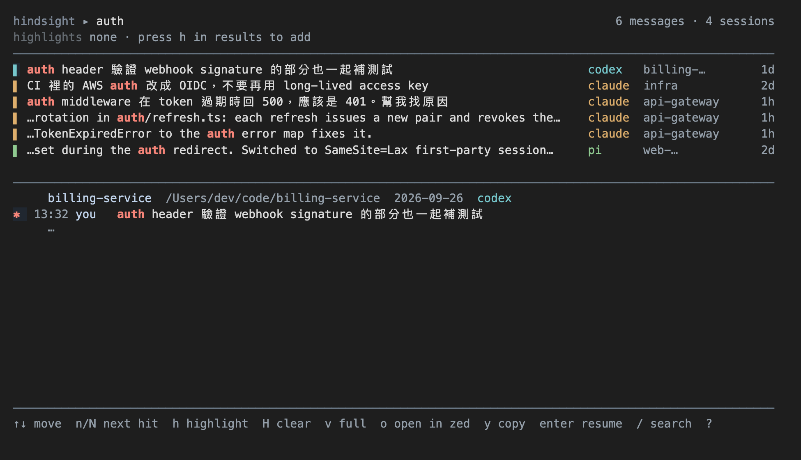

# hindsight

**Search every Claude Code, Codex and Pi session on your Mac, down to the message, in English, Chinese, Japanese and Korean.**

<p align="center">
  
</p>

- **Message-level hits.** Every row is the message that matched, ranked by BM25, with its agent, project and age.
- **Real CJK search.** [fts5-cjk](https://github.com/Ray0907/fts5-cjk) is compiled in, so `結帳`, `ログイン` and `결제` match inside running text.
- **Read the context, then continue.** The transcript folds unrelated turns into `⋯`. `enter` resumes the session in its own directory with `claude --resume`, `codex resume` or `pi --session`. `o` opens the project in your editor.
- **Local and read-only.** It never writes to agent stores. The only file it writes is its own index in `~/.cache/hindsight`.

<p align="center">
  
</p>

<sub>Screenshots show the real TUI running on a synthetic demo home (<code>demo/make_demo_home.py</code>, regenerated by <code>demo/screenshot.sh</code>). Every project and conversation in them is invented.</sub>

macOS for now. Linux is planned.



## Install

### Download (macOS)

Grab the archive for your Mac from [Releases](https://github.com/Ray0907/hindsight/releases/latest): `darwin_arm64` for Apple Silicon, `darwin_amd64` for Intel.

```sh
arch=$(uname -m | sed 's/x86_64/amd64/')
curl -fsSLO "https://github.com/Ray0907/hindsight/releases/latest/download/SHA256SUMS"
file=$(grep "darwin_${arch}" SHA256SUMS | awk '{print $2}')
curl -fsSLO "https://github.com/Ray0907/hindsight/releases/latest/download/${file}"
shasum -a 256 -c SHA256SUMS --ignore-missing
tar -xzf "$file" hindsight && sudo mv hindsight /usr/local/bin/
```

The binary is not notarized. Downloaded with `curl` it runs as is; if you downloaded it in a browser and macOS blocks it, run `xattr -d com.apple.quarantine /usr/local/bin/hindsight`.

### From source

Requires Go 1.26+ and a C compiler (Xcode Command Line Tools).

```sh
go install -tags sqlite_fts5 github.com/Ray0907/hindsight@latest
# or, from a checkout:
make build
```

The `sqlite_fts5` build tag is required.

## Use

```sh
hindsight                    # recent sessions
hindsight 紅茶                # interactive search
hindsight --json snapshot    # JSON Lines for scripts/agents
hindsight --harness pi 魚池   # restrict to one agent
hindsight index              # sync and print counts
hindsight index --rebuild    # replace the index
```

When stdout is not a TTY, search prints JSON Lines automatically. `--version` prints the version; `--no-mouse` disables mouse input. The initial scan runs on first use; the TUI opens with its existing index and refreshes when the scan finishes.

Search: space means AND; `"black tea"` is an exact phrase; `-word` excludes; bare words are prefixes (`resum` finds `resuming`); `--flag` is a literal. CJK terms match inside text, including single characters. Empty or negative-only queries show the latest message of each recent session. Results are limited to 300: selective queries use FTS5 BM25 (newest first on ties); queries whose positive ASCII terms and full FTS match both cover at least 90% use newest matching message time instead. Only a single unquoted 1–2 letter Latin prefix is restricted to messages from the seven days before the index's latest timestamp; older matches for those broad queries are omitted.

| Key | Action |
| --- | --- |
| typing | search (30 ms debounce) |
| ↓ / Esc | search → results |
| ↑↓ / j k | select message; ↑ on first row returns to search |
| / | focus search |
| n / N | next / previous hit in transcript |
| h / H | add a highlight / clear highlights |
| v | toggle full transcript |
| o | open project in editor |
| y | copy resume command |
| Enter | resume selected session in its original directory |
| Tab / Shift-Tab | cycle all / claude / codex / pi |
| ? | help |
| Ctrl-C / Esc in results | quit |

Mouse clicks select/focus rows, click a highlighter tag to remove it, and wheel scrolls. Colors follow terminal background; `HINDSIGHT_THEME=light|dark` overrides detection.

Editor resolution: `HINDSIGHT_EDITOR`, then `VISUAL`, then the first available `zed`, `cursor`, `code`, `subl`, then supported macOS apps, then Finder. Clipboard uses `pbcopy` plus OSC 52.

## Data and privacy

**Local-only and read-only:** transcript stores are never changed or uploaded. The only persistent writes are the search index under `$XDG_CACHE_HOME/hindsight/index.db` (or `~/.cache/hindsight/index.db`). Override it with `HINDSIGHT_INDEX`; override source roots independently with `HINDSIGHT_CLAUDE_DIR`, `HINDSIGHT_CODEX_DIR`, `HINDSIGHT_PI_DIR`. `$HOME` controls the default roots. Set `HINDSIGHT_DEBUG_TIMING=1` for startup/sync/query/snippet/render timings on stderr.

Search tokenization uses [fts5-cjk](https://github.com/Ray0907/fts5-cjk), statically linked under its original license in `internal/cjk/`.

## License

MIT. Bundles [fts5-cjk](https://github.com/Ray0907/fts5-cjk) (MIT) and SQLite headers (public domain).
